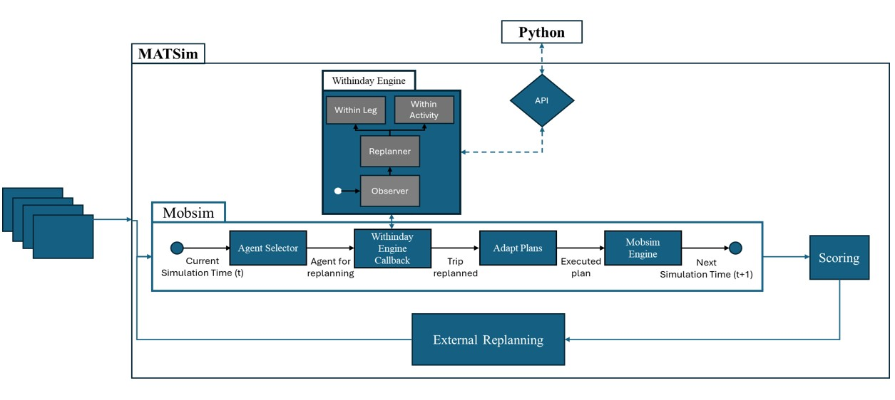

# MATSim Within-Day Python Bridge

An extensible hybrid framework that connects **[MATSim](https://www.matsim.org/) (Multi-Agent Transport Simulation)** in Java with Python's machine learning, reinforcement learning, optimization and scientific computing ecosystem, so that agents can make **adaptive, real-time, within-day decisions** during a running simulation.


---

## Table of Contents

- [Overview](#overview)
- [System Architecture](#system-architecture)
- [Repository Structure](#repository-structure)
- [Prerequisites](#prerequisites)
- [Quick Start](#quick-start)
- [Running Locally](#running-locally)
- [Running with Docker](#running-with-docker)
- [Configuration Reference](#configuration-reference)
- [Developing Your Own Project](#developing-your-own-project)
- [Output](#output)
- [Troubleshooting](#troubleshooting)
- [Contributing](#contributing)
- [License](#license)
- [Citation](#citation)

---

## Overview

MATSim provides a scalable, event-driven framework for agent-based traffic simulation. Python provides a vast collection of libraries for learning and optimization. This project lets the two work together:

- **MATSim (Java)** remains the core simulation engine: network dynamics, agent interactions, congestion and event processing.
- **Python** acts as the cognitive "brain": it receives observations from the running simulation and returns decisions, without breaking simulation synchronization.

Typical Python-side tooling includes:

| Area | Libraries |
|---|---|
| Deep learning | PyTorch, TensorFlow |
| Reinforcement learning | Stable-Baselines3, Ray/RLlib |
| Optimization & operations research | SciPy, CVXPY, NetworkX, OR-Tools |
| Data science & spatial modeling | Pandas, NumPy, Scikit-Learn, GeoPandas |

Agents can therefore act on pre-trained neural networks, progressively evolving behavioral policies, or global optimization algorithms, for example choosing a travel mode (car, public transit, walking) or re-routing mid-day.

---

## System Architecture



The framework has two layers, and an optional layer for process orchestration.

### 1. Java simulation

The execution engine. It runs the MATSim `QSim` and is responsible for:

- **Macroscopic traffic simulation:** vehicle movement, queue dynamics and congestion across links and nodes.
- **Event monitoring and triggers:** listens to simulation events for agents flagged by the `AgentSelector`, e.g. when an agent finishes an activity and is about to depart or switch trip legs.
- **State observation:** the `WithinDayObserver` builds a local state vector from the network snapshot around the agent in space and time.
- **Real-time plan adaptation:** the `WithinDayReplanner` rewrites the agent's plan (itinerary, activity schedule, upcoming trip choices) using the response from Python.
- **IPC lifecycle management:** the `CommunicationManager` starts and health-checks the communication channel to the Python service.

### 2. Python service

A high-performance service (e.g. FastAPI + Uvicorn) that receives serialized agent observations and returns decisions:

- **Agent model initializer:** maintains state configuration and policy networks per agent.
- **Inference and policy engine:** uses agent experience to improve the policy.
- **Action decision handler:** evaluates the valid action space (e.g. mode choice, route replanning) and returns the chosen action to Java.

### 3. Distributed orchestration

A Python runner (`withinday.core.pymatsim` and `withinday.core.nodes.WorkerNode`) that assembles the Java command line: JVM heap size, thread count, output directory, and injection of project-specific configuration and custom replanner/observer classes. It is the entry point inside Docker and is suitable for cluster or multi-node tuning runs.

---

## Repository Structure

```text
.
├── Dockerfile.txt                  # Container image (Python 3.12 + JDK 25)
├── a7-rl-testbed-0.0.1-SNAPSHOT    # Java executable file (.jar)
├── pom.xml / mvnw / mvnw.cmd       # Maven build
├── images/                         # Documentation images
├── scenarios/
│   └── <scenario>/                 # e.g. sioux-falls
│       ├── input/                  # config.xml, network, plans, ...
│       └── output/                 # simulation results
│           └── project/            # e.g. random_choice
├── shared_storage/                 # Data shared between runs/containers
└── src/
    ├── main/
    │   ├── java/org/matsim/withinday/ 
    │       ├── core/             # Core functionalities of the within-day framework
    │       │   ├── AgentSelector.java     # Samples external policy governed agents
    │       │   ├── RunWithinDay.java      # Abstract run class for within-day
    │       │   ├── WithinDayListener.java # Within-day events listener   
    │       │   └── WithinDayReplanner.py  # Abstract replanner class
    │       ├── environment/      # Methods interacting with Mobsim environment
    │       │   ├── AgentAssetInventory.java  # Tracks relative location of transport mode
    │       │   ├── MatsimScoreTracker.java   # Tracks agent specific kai-nagel score
    │       │   ├── StateEnginer.java         # 
    │       │   ├── WithinDayObserver.java    # Abstract observer class   
    │       │   └── WithinDayScoring.java     # Abstract scoring engine class
    │       ├── networking/      # Java front-end communication bridge  
    │       │   ├── CommunicationManager.java # Abstract http communication class   
    │       │   └── UnixSocketCommunicationManager.java # Specialized unix class  
    │       └── utils/           # Java helper functions         
    │   └── python/withinday/
    │       └── core/            # Distributed orchestration functionalities
    │       │   ├── pymatsim.py     # run_simulation(): reads env vars, launches a worker
    │       │   └── nodes.py        # WorkerNode: builds & runs the Java command
    │       ├── networking/      # Python back-end communication bridge 
    │       │   ├── main.py         # FastAPI server exposing MATSim bridge endpoints
    │       │   ├── python_matsim_bridge.py # Abstract bridge class
    │       │   └── Models.py       # Pydantic schemas for MATSim agent data
    │       └── Pipfile          # python environment   
    ├── projects/
    │   └── modechoice/random/   # Example project: random mode choice
    │       ├── java/               # Replanner / observer / runner (Java)
    │       └── python/             # Bridge service + run script (Python)
    └── test/java/org/matsim/
        └── random_mode_choice/   # Example test folder: random mode choice
            └── run_test.ps1/       # powershell run script to test random mode choice
```

---

## Prerequisites

| Requirement | Version | Needed for |
|---|---|---|
| JDK | 25 | Local runs |
| Python | 3.12 | Local runs |
| Maven | via `./mvnw` wrapper | Building `simulation.jar` |
| Docker | recent | Container runs |
| WSL 2 (with Docker) | - | Container runs on Windows |

---

## Quick Start

```bash
git clone -b development https://github.com/Alirockman1/matsim-withinday-python.git
cd matsim-withinday-python
```

Already cloned? Switch with `git checkout development`.

Then follow either [Running Locally](#running-locally) or [Running with Docker](#running-with-docker).

---

## Running Locally

### 1. Set environment variables
Replace `<MainClass>` with the fully qualified class containing your `main` method, `<Service>` / `<YourObserver>` / `<YourReplanner>` with your **Bridge Service class** \ **Observer class** \ **Replanner class** that should run, and `<scenario>` / `<project_name>` with your scenario and project.

**Linux / macOS**

```bash
export JAVA_HOME="/opt/jdk-25" # Replace place holder with location of java bin folder
export PYTHONPATH="$PWD/src/main/python:$PWD/src/projects"
export PATH="${JAVA_HOME}/bin:${PATH}"
export MATSIM_OUTPUT_BASE="$PWD/scenarios/<scenario>/output/"

# Which Python bridge service Java should start:
export SERVICE_CLASS="<project_name>.python.networking.bridge_service.<Service>"
```

**Windows (PowerShell)**

```powershell
$env:JAVA_HOME = "C:\path\to\jdk-25" # Replace with location of java bin folder
$env:PYTHONPATH = "$PWD\src\main\python;$PWD\src\projects"
$env:PATH = "$env:JAVA_HOME\bin;" + $env:PATH
$env:MATSIM_OUTPUT_BASE = "$PWD\scenarios\<scenario>\output\"
$env:SERVICE_CLASS = "<project_name>.python.networking.bridge_service.<Service>"
```

**Note:** Additionally an *env* file can be used to set up the environment parameters.

### 2. Install Python dependencies (only for the first time setting the project)
Install the dependencies in a virtual environment rather than into your system Python. This keeps the setup reproducible. **Python 3.12 is required.**


> **One-time setup.** Creating the environment and installing the dependencies only needs to be done **the first time**. In every later session you only need to [activate the environment](#activate-the-environment-every-new-terminal).

#### Linux

```bash
# Debian/Ubuntu: the venv module is a separate package (if not already installed)
sudo add-apt-repository ppa:deadsnakes/ppa
sudo apt update
sudo apt install python3.12 python3.12-venv

python3.12 -m venv .venv
source .venv/bin/activate
```

#### Windows
```bash
py -3.12 -m venv .venv
.venv\Scripts\Activate.ps1
```

After activating the environment install all dependent packages.

```bash
cd src/main/python
pip install pipenv
pipenv install --system --deploy --skip-lock
pip install -e .
cd ../../..
```
#### Activate the environment (every new terminal)

After the first-time setup, **only activation is needed**. Do this in each new terminal, from the repository root, before starting the Java side:

| OS | Command |
|----|---------|
| Linux / macOS | `source .venv/bin/activate` |
| Windows (PowerShell) | `.venv\Scripts\Activate.ps1` |
| Windows (cmd) | `.venv\Scripts\activate.bat` |


Run the full setup again only if you delete `.venv`, switch Python versions, or the dependencies change (for example after pulling updates that modify `Pipfile` or `Pipfile.lock`).

### 3. Build the Java project

**Linux / macOS**

```bash
chmod +x mvnw
./mvnw clean install -DskipTests
```

**Windows (PowerShell)**

```powershell
.\mvnw.cmd clean install -DskipTests
```

>**Note:** Check where the jar was created (e.g. `ls *.jar`) and use that file in the next step.

### 4. Run the simulation

**Linux / macOS**
 
```bash
rm -rf scenarios/<scenario>/output/project/<project_name>  
 
java -Xmx12g -Djava.awt.headless=true \
  -cp a7-rl-testbed-0.0.1-SNAPSHOT.jar \
  <MainClass> \
  scenarios/<scenario>/input/config.xml \
  --config:controller.outputDirectory=scenarios/<scenario>/output/project/<project_name> \
  --config:controller.lastIteration=9 \
  --config:global.numberOfThreads=4 \
  --config:withinday.agentsPerIteration=1 \
  --config:withinday.replanner=<YourReplanner> \
  --config:withinday.observer=<YourObserver>
```
 
**Windows (PowerShell)**
 
```powershell
Remove-Item -Recurse -Force scenarios\<scenario>\output\project\<project_name> -ErrorAction SilentlyContinue
 
java -Xmx12g -Djava.awt.headless=true `
  -cp target\a7-rl-testbed-0.0.1-SNAPSHOT.jar `
  <MainClass> `
  scenarios\<scenario>\input\config.xml `
  --config:controller.outputDirectory=scenarios/<scenario>/output/project/<project_name> `
  --config:controller.lastIteration=9 `
  --config:global.numberOfThreads=4 `
  --config:withinday.agentsPerIteration=1 `
  --config:withinday.replanner=<YourReplanner> `
  --config:withinday.observer=<YourObserver>
```
>
 **Note:**
 - The Java process launches the **Python bridge service** itself (via the `CommunicationManager`). The service to start is selected by the `SERVICE_CLASS` environment variable, and Python must be able to import it, so `SERVICE_CLASS` and `PYTHONPATH` must be set **in the shell that runs `java`**. You do not start the Python service manually.
 
 - Omitting `--config:withinday.replanner` / `observer` uses the framework defaults.

 - `WorkerNode` currently invokes `/app/simulation.jar` and `pymatsim` reads scenario files from `/app/scenarios/...`. These paths exist inside the Docker image. For the Python wrapper to work outside Docker you need to mirror those paths (or make them configurable). The direct `java` command above works anywhere.

---

## Running with Docker

The container bundles Python 3.12, JDK 25, all Python dependencies and the simulation jar, so no manual setup is required.

### How the container works

- `Dockerfile.txt` installs JDK 25, installs the Python dependencies, copies `src/` and the simulation jar (to `/app/simulation.jar`), and declares three volumes: scenario input, scenario output and `shared_storage`.
- The entrypoint is `sh -c` and the default command is `python3 $RUN_SCRIPT`, so the container runs whichever Python script you pass in `RUN_SCRIPT`.
- That script calls `run_simulation(...)`, which reads the environment variables listed in the [Configuration Reference](#configuration-reference) and launches the Java process through `WorkerNode`.
- -config:... The environment (including `SERVICE_CLASS`) is inherited by Java, which starts the Python bridge service inside the same container.


### Before you build: the jar
 
`Dockerfile.txt` contains `COPY a7-rl-testbed-0.0.1-SNAPSHOT.jar /app/simulation.jar`, so ensure the file is in the **repository root** (the build context).

### Linux / macOS

**1. Build the Java project**

```bash
chmod +x mvnw
./mvnw clean install -DskipTests
```

**2. Build the Docker image**

The Dockerfile copies the jar from the build context root (`a7-rl-testbed-0.0.1-SNAPSHOT.jar`). Make sure the jar is available there (e.g. copy it from `target/`) before building.

```bash
docker build -f Dockerfile.txt -t matsim-rl:development .
```

**3. Run the container**

Replace `<RUN_SCRIPT>` with the full in-container path of your project's java wrapper.

```bash
SCENARIO=<scenario>        # Scenario name i.e. sioux-falls
PROJECT=<save_folder_name> # The folder in the output directory i.e. random_choice
REPLANNER=<YourReplanner>  # java class name i.e. RandomModeChoiceReplanner
OBSERVER=<YourObserver>    # java class name i.e. RandomModeChoiceObserver
RUNNER=<RUN_SCRIPT>        # Full path to the python warpper function 
# i.e. "/app/src/projects/modechoice/random/python/core/run_random_mode_choice.py"

rm -r $PWD/scenarios/$SCENARIO/output/project/$PROJECT

docker run --rm -it \
  -e OBJECTIVE="single" \
  -e SCENARIO="$SCENARIO" \
  -e MATSIM_OUTPUT_BASE="/app/scenarios/$SCENARIO/output" \
  -e MATSIM_ITERATION="9" \
  -e NUM_THREADS="4" \
  -e JAVA_HEAP="12g" \
  -e AGENTS_PER_ITERATION="1" \
  -e REPLANNER_CLASS="$REPLANNER" \
  -e OBSERVER_CLASS="$OBSERVER" \
  -e RUN_SCRIPT="<RUN_SCRIPT>" \
  -v "$PWD/scenarios/$SCENARIO/input:/app/scenarios/$SCENARIO/input" \
  -v "$PWD/scenarios/$SCENARIO/output/project/$PROJECT:/app/scenarios/$SCENARIO/output" \
  -v "$PWD/shared_storage:/app/shared_storage" \
  matsim-rl:development
```

### Windows (PowerShell + WSL 2)

```powershell
# 1. Start the Docker service in WSL
wsl -u root service docker start

# 2. Build the Java project
.\mvnw.cmd clean install -DskipTests

# 3. Build the image
wsl docker build -f Dockerfile.txt -t matsim-rl:development .

# 4. Run the container (paths must be WSL paths, e.g. /mnt/c/...)
wsl docker run --rm -it `
  -e OBJECTIVE="single" `
  -e SCENARIO="<scenario>" `
  -e MATSIM_OUTPUT_BASE="/app/scenarios/<scenario>/output" `
  -e MATSIM_ITERATION="9" `
  -e NUM_THREADS="4" `
  -e JAVA_HEAP="12g" `
  -e AGENTS_PER_ITERATION="1" `
  -e REPLANNER_CLASS="<YourReplanner>" `
  -e OBSERVER_CLASS="<YourObserver>" `
  -e RUN_SCRIPT="<RUN_SCRIPT>" `
  -v "/mnt/path/to/scenarios/<scenario>/input:/app/scenarios/<scenario>/input" `
  -v "/mnt/path/to/scenarios/<scenario>/output/project:/app/scenarios/<scenario>/output" `
  -v "/mnt/path/to/shared_storage:/app/shared_storage" `
  matsim-rl:development
```

**One-command run**

The container can also be run directly using a powershell script (for reference look at `run_test.ps1` scripts in `\src\test\java\ord\matsim\.`). This automates the whole pipeline: start Docker in WSL, rebuild the jar, rebuild the image, convert Windows paths to WSL paths, and run the container.

1. Copy the existing `run_test.ps1` into your own project.

2. Edit the parameters at the top of the script:

   | Variable | Meaning |
   |---|---|
   | `$RUN_SCRIPT` | In-container path of the Python run script |
   | `$OBSERVER_CLASS` / `$REPLANNER_CLASS` | Custom within-day classes |
   | `$SCENARIO_NAME` | Scenario folder under `scenarios/` |
   | `$OBJECTIVE` | `single` or `multi` |
   | `$MATSIM_ITERATION` | Last MATSim iteration |
   | `$NUM_THREADS`, `$MEMORY` | Threads and JVM heap |
   | `$NUM_AGENTS_PER_ITERATION` | Agents handled per iteration (`multi` mode) |
   | `$UPDATE_JAR` | Rebuild the jar with Maven before running |
   | `$REBUILT_DOCKER` | Remove and rebuild the Docker image before running |

2. Run it:

   ```powershell
   .\run_test.ps1
   ```

---

## Configuration Reference

### Environment variables (read by `pymatsim.run_simulation`)

| Variable | Required | Default | Description |
|---|---|---|---|
| `SCENARIO` | Yes | - | Scenario name; config is read from `/app/scenarios/$SCENARIO/input/config.xml` |
| `MATSIM_OUTPUT_BASE` | Yes | - | Output directory passed to `controller.outputDirectory` |
| `MATSIM_ITERATION` | Yes | - | Last iteration (`controller.lastIteration`) |
| `NUM_THREADS` | Yes | - | Thread count (`global.numberOfThreads`) |
| `OBJECTIVE` | Yes | - | `single` (one agent per iteration) or `multi` |
| `AGENTS_PER_ITERATION` | If `multi` | `1` in `single` | Agents processed per iteration (`withinday.agentsPerIteration`) |
| `JAVA_HEAP` | No | `12g` | JVM max heap (`-Xmx`) |
| `REPLANNER_CLASS` | No | `default` | Sets `withinday.replanner` |
| `OBSERVER_CLASS` | No | `default` | Sets `withinday.observer` |
| `RUN_SCRIPT` | Yes | - | Python wrapper for java, executed by the container |
| `SERVICE_CLASS` | Project-specific | - | Bridge service class, set by the project's run script |

### Java config overrides

Any MATSim config parameter can be overridden with `--config:<module>.<param>=<value>`. `WorkerNode` accepts an `extra_config` dictionary and appends each non-`None` entry as such an override.

### Python API

```python
from withinday.core.pymatsim import run_simulation

run_simulation(
    run_script="org.matsim.withinday.core.RunWithinDay",  # Java main class
    extra_config={"withinday.someParam": "value"},        # optional overrides
)
```

`run_simulation` prints the total runtime when the simulation finishes, whether or not it succeeded. A non-zero Java exit code raises `subprocess.CalledProcessError`.

---

## Developing Your Own Project

Projects live in `src/projects/<project_name>/`, split into a Java and a Python side. The `modechoice/random` project is the reference example.

1. **Create the project folders**, e.g. `src/projects/mymodel/myproject/{java,python}`.
2. **Implement the Java side:** a `WithinDayObserver` (what the agent sees), a `WithinDayReplanner` (how the plan is changed from the response) and a main runner class.
3. **Implement the Python side:** a bridge service that receives observations and returns actions (your model, policy or optimizer goes here).
4. **Add a run script (Only for container)** that selects your service and Java runner:

   ```python
   import os
   from withinday.core.pymatsim import run_simulation

   def run_pipeline():
       os.environ["SERVICE_CLASS"] = "mymodel.myproject.python.networking.bridge_service.MyBridgeService"
       run_simulation(run_script="mymodel.myproject.java.core.RunMyProjectWithinDay")

   if __name__ == "__main__":
       run_pipeline()
   ```

5. **Run it** by passing your custom `MainClass`, `Service`, `REPLANNER`, `OBSERVER` classses, and defining the project `<scenario>` / `<project_name>` folders as shown in either [Running Locally](#running-locally) or with the additional wrapper (`RUN_SCRIPT`) in [Running with Docker](#running-with-docker).

> **Warning:** Each new run **deletes the contents of the output folder** before it starts. Back up any results you want to keep.

> **Note:** New projects are encouraged to follow this structure: each one should include its own `README.md` with setup and run instructions, and an environment file (`env.sh` for Linux/macOS, `env.ps1` for Windows) so others can reproduce the setup easily.

---

## Output

Results are written to `MATSIM_OUTPUT_BASE` (inside Docker, the mounted `scenarios/<scenario>/output/...` folder). `shared_storage/` is mounted for data that should persist or be shared across runs, such as trained models or logs.

---

## Troubleshooting

| Symptom | Likely cause / fix |
|---|---|
| `docker build` fails at `COPY ...SNAPSHOT.jar` | The jar is not in the build context root. Build with Maven and copy it there, or adjust the `COPY` line. |
| `TypeError` / `None` on `int(os.environ.get("AGENTS_PER_ITERATION"))` | `OBJECTIVE=multi` was set without `AGENTS_PER_ITERATION`. |
| Java: `Could not find or load main class` | Wrong `<MainClass>`, or the jar is not in the classpath (`target/*` locally, `/app/simulation.jar` in Docker). |
| Config file not found in container | `SCENARIO` is unset or the input volume path is wrong. |
| `docker: Cannot connect to the Docker daemon` (Windows) | Run `wsl -u root service docker start`. |
| `OutOfMemoryError` | Increase `JAVA_HEAP` / `-Xmx`. |
| Output folder unexpectedly empty (Windows) | `run_test.ps1` wipes it in `single` mode by design. |
| Linux: Output folder is being used by another process | The output file needs to be deleted before restarting the same run. |

---

## Contributing

Contributions are welcome.

1. Fork the repository and create a feature branch: `git checkout -b feature/my-change`
2. Make your changes, with tests where applicable.
3. Verify the build: `./mvnw clean install`
4. Open a pull request describing what changed and why.

---

## License

Add your license here (e.g. MIT, Apache-2.0) and include a `LICENSE` file in the repository root.

---

## Citation

If you use this framework in academic work, please cite it as:

```bibtex
@software{matsim_withinday_python_bridge,
  title  = {MATSim Within-Day Python Bridge},
  author = {Your Name},
  year   = {2026},
  url    = {https://github.com/your-username/matsim-withinday-python-bridge}
}
```
